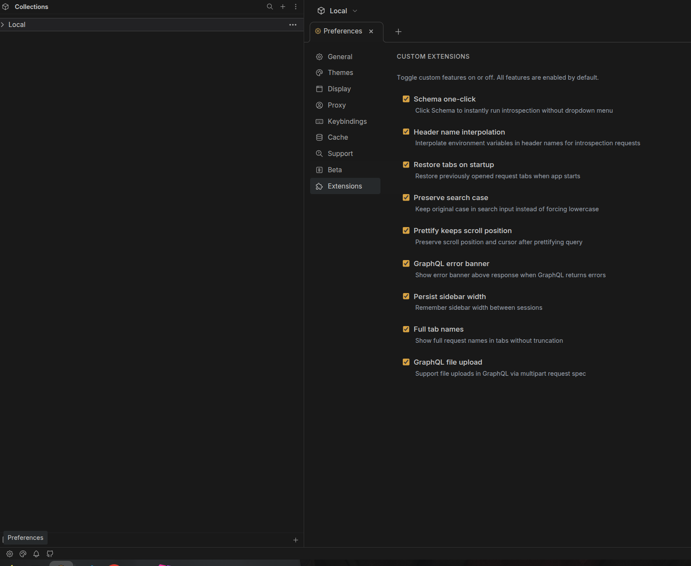
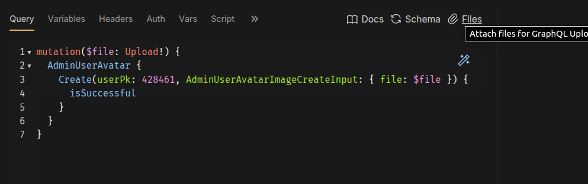

# Bruno Extended

Форк [Bruno](https://github.com/usebruno/bruno) — open-source клиент для работы с API, с кастомными расширениями для удобной работы с GraphQL.

Все кастомные фичи **включены по умолчанию** и могут быть индивидуально отключены в **Preferences > Extensions**, полностью возвращая оригинальное поведение Bruno.

## Скачивание

Готовые сборки доступны на странице [Releases](https://github.com/Evolyuta/bruno-front/releases):

- **Linux**: `.AppImage` — сделать исполняемым и запустить (`chmod +x`, может потребоваться `sudo apt install libfuse2` и запуск с `--no-sandbox`)
- **Windows**: `.zip` — распаковать и запустить `Bruno.exe`

## Сборка из исходников

```bash
git clone git@github.com:Evolyuta/bruno-front.git
cd bruno-front

nvm install 22.12.0
nvm use

npm i --legacy-peer-deps
npm run setup

# Linux (.AppImage)
npm run dist:linux --workspace=packages/bruno-electron

# macOS (.dmg)
npm run dist:mac --workspace=packages/bruno-electron

# Windows (.exe) — собирать на Windows
npm run dist:win --workspace=packages/bruno-electron
```

Готовый файл будет в `packages/bruno-electron/out/`.

## Отличия от оригинального Bruno

Все расширения можно включить/выключить в **Preferences > Extensions**.



### Schema one-click
Клик по кнопке Schema сразу запускает introspection без выпадающего меню.
При отключении: возвращается оригинальный dropdown с пунктами "Load from Introspection" / "Load from File".

### Header name interpolation
Переменные окружения (например `{{appTokenKey}}`) подставляются в **имена** хедеров при introspection запросах, а не только в значения.
При отключении: интерполируются только значения хедеров (оригинальное поведение).

### Restore tabs on startup
Ранее открытые вкладки с запросами восстанавливаются при запуске приложения, включая состояние sidebar.
При отключении: приложение запускается с пустым обзором workspace (оригинальное поведение).

### Preserve search case
Поле поиска сохраняет регистр как набрано, а не переводит в нижний регистр.
При отключении: текст поиска принудительно переводится в lowercase (оригинальное поведение).

### Prettify keeps scroll position
Позиция скролла и курсора сохраняются после форматирования GraphQL запроса.
При отключении: редактор проматывается вверх после prettify (оригинальное поведение).

### GraphQL error banner
Красный баннер с сообщением об ошибке отображается над ответом, когда GraphQL возвращает ошибки.
При отключении: баннер не показывается, ошибки видны только в JSON-ответе (оригинальное поведение).

### Persist sidebar width
Ширина sidebar сохраняется между сессиями.
При отключении: sidebar сбрасывается к ширине 250px при перезапуске (оригинальное поведение).

### Full tab names
Названия вкладок показываются полностью без обрезания. Кнопка закрытия — обычный элемент, а не наложение поверх текста.
При отключении: вкладки ограничены 180px с эффектом затухания (оригинальное поведение).

### GraphQL file upload
Поддержка загрузки файлов через [graphql-multipart-request-spec](https://github.com/jaydenseric/graphql-multipart-request-spec).
Используйте кнопку **Files** рядом с Schema для прикрепления файлов.



При отключении: кнопка Files скрывается, загрузка файлов недоступна (оригинальное поведение).

## Лицензия

[MIT](license.md)

Основано на [Bruno](https://github.com/usebruno/bruno) от Anoop M D и контрибьюторов.
